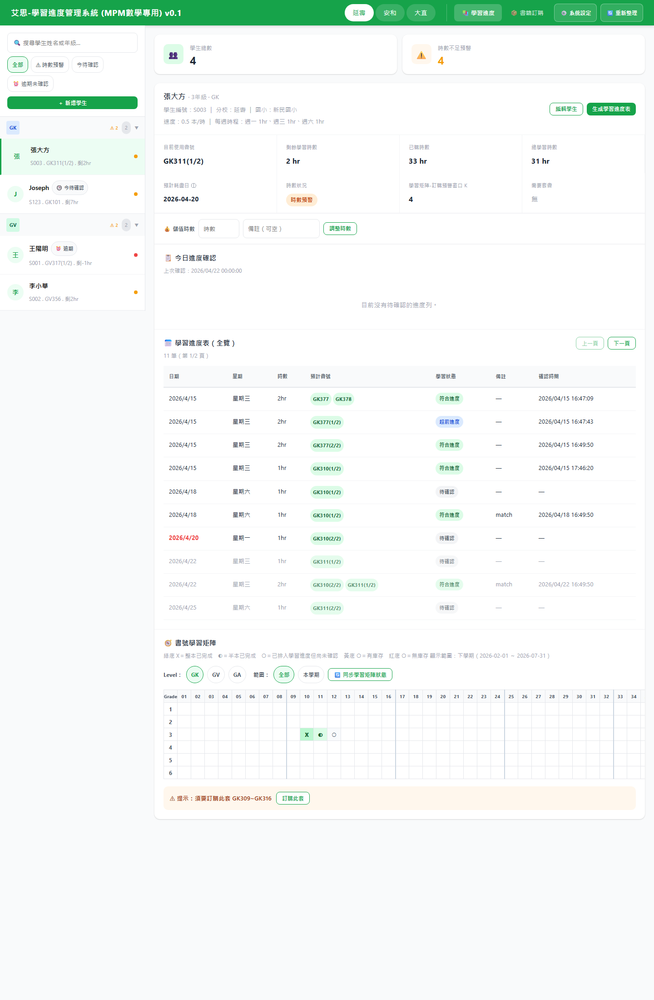
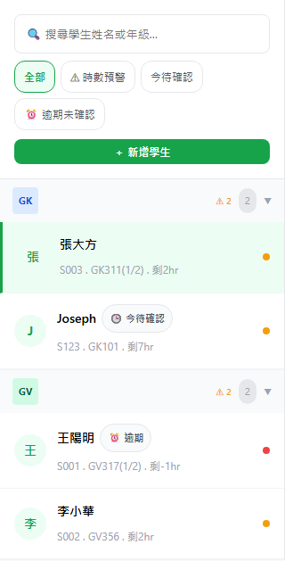
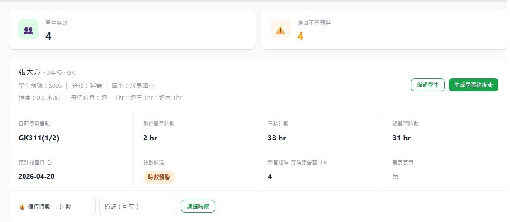
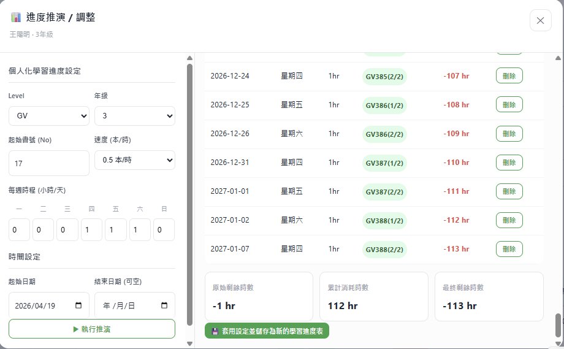
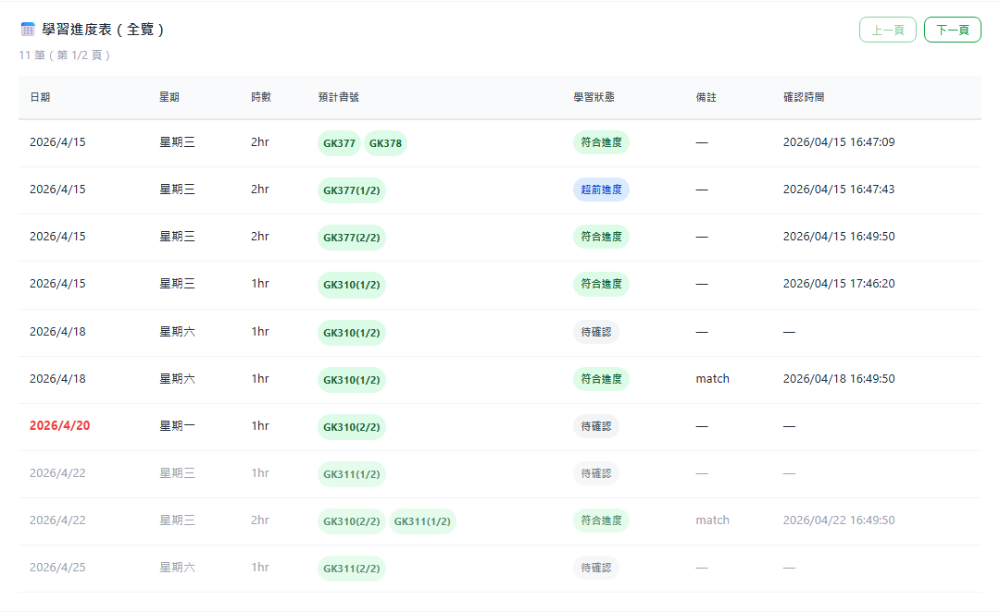
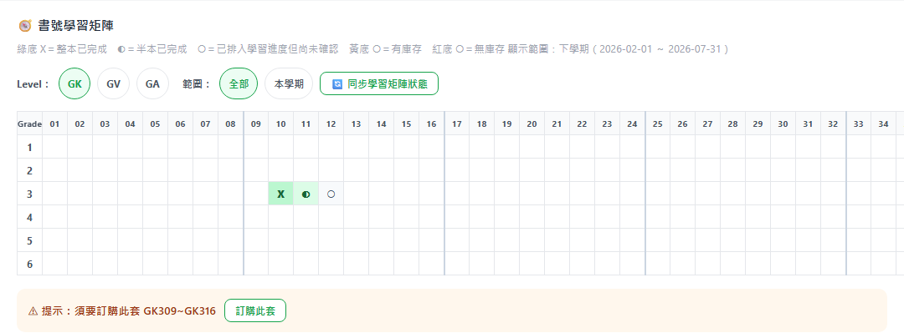
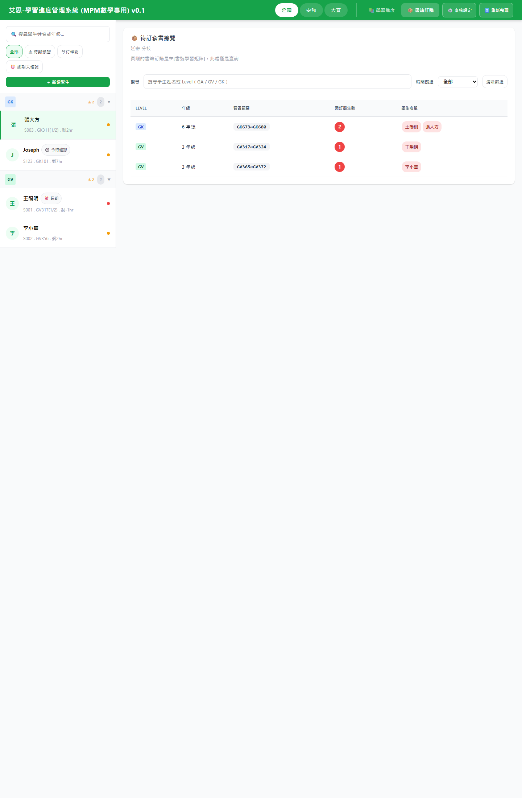

# MPM 學習進度管理系統 圖文使用手冊

## 目錄
- [1. 文件說明](#1-文件說明)
- [2. 首頁總覽](#2-首頁總覽)
- [3. 全頁畫面導覽](#3-全頁畫面導覽)
- [4. 左側學生列表操作](#4-左側學生列表操作)
- [5. 新增 / 編輯學生](#5-新增--編輯學生)
- [6. 學生詳細資料區](#6-學生詳細資料區)
- [7. 儲值時數功能](#7-儲值時數功能)
- [8. 生成學習進度表](#8-生成學習進度表)
- [9. 今日進度確認](#9-今日進度確認)
- [10. 學習進度表（全覽）](#10-學習進度表全覽)
- [11. 書號學習矩陣](#11-書號學習矩陣)
- [12. 系統設定](#12-系統設定)
- [13. 書籍訂購模組](#13-書籍訂購模組)
- [14. 常見畫面結果解讀](#14-常見畫面結果解讀)
- [15. 建議操作順序](#15-建議操作順序)
- [16. 相關文件](#16-相關文件)

## 1. 文件說明
本文件為 **MPM 學習進度管理系統** 的圖文版使用手冊。  
截圖來源為本機瀏覽器開啟：

- `https://itrobotics.github.io/learning_progress/`

搭配文字說明，協助理解畫面區塊、操作方式、設定欄位與結果判讀。

---

## 2. 首頁總覽
下圖為桌面版系統首頁畫面，可同時看到上方導覽列、左側學生列表與右側主內容。

手機版則改為：
- 上方僅保留 `☰ 選單`
- 分校切換、模組切換、系統設定、重新整理、搜尋 / 篩選、學生清單集中在 Drawer
- 主畫面主要保留目前學生的詳細資訊

首頁主要分成三個區域：

1. **上方導覽列**
   - 分校切換
   - 模組切換
   - 系統設定
   - 重新整理

2. **左側學生列表**
   - 搜尋學生
   - 依條件 filter
   - 依 Level 分組
   - 新增學生

3. **右側主內容區**
   - 學生 KPI
   - 學生詳細資料
   - 今日進度確認
   - 學習進度表
   - 書號學習矩陣

---

## 3. 全頁畫面導覽
下圖為首頁的全頁截圖，可看到主要內容由上到下的分布。

上方綠色列為系統主導覽，包含：

- **分校切換**
  - 延壽
  - 安和
  - 大直

- **模組切換**
  - `📚 學習進度`
  - `📦 書籍訂購`

- **功能按鈕**
  - `⚙️ 系統設定`
  - `🔄 重新整理`

右側主內容依序顯示：

- KPI 摘要
- 學生詳細資料
- 今日進度確認
- 學習進度表
- 書號學習矩陣

---

## 4. 左側學生列表操作
左側欄位用來選擇學生與快速篩選。

可使用的功能包括：

- 搜尋學生姓名或年級文字
- 使用 `全部`、`⚠ 時數預警`、`今待確認`、`⏰ 逾期未確認` 等 filter
- 依 Level 群組展開學生
- 查看學生卡片中的：
  - 姓名
  - 學生編號
  - 目前使用書號
  - 剩餘時數
  - 待確認 badge
  - 預警資訊
- 點選 `＋ 新增學生` 建立新學生

badge 常見意義：

- `🕒 今待確認`：今天有待確認進度
- `⏰ 逾期`：有過期未確認進度

---

## 5. 新增 / 編輯學生
可從左側 `＋ 新增學生` 建立學生，或從右側詳細區 `編輯學生` 修改既有資料。

主要欄位通常包含：

- 學生編號
- 學生姓名
- 分校
- 國小
- Level
- 年級
- 起始書號
- 速度
- 剩餘學習時數
- 已購時數
- 訂購預警 K
- 每週時程

常見驗證規則：

- 學生編號必填
- 學生姓名必填
- 分校必選
- 起始書號需大於 0
- 時數不可為負數

編輯模式下可使用 `刪除學生` 刪除此學生。

---

## 6. 學生詳細資料區
在右側詳細卡片中，可查看目前選取學生的重要資訊。

主要欄位包含：

- 目前使用書號
- 剩餘學習時數
- 已購時數
- 總學習時數
- 預計耗盡日
- 時數狀況
- 學習矩陣-訂購預警窗口 K
- 需要套書

`需要套書` 會以套書區間格式顯示，例如：

- `GK201~GK208`
- `GV433~GV440`

若有多套，會以 `、` 串接。  
若沒有需求，顯示 `無`。  
若進度表尚未載入完成，顯示 `載入進度表中…`。

此區也可看到：

- `編輯學生`
- `生成學習進度表`

---

## 7. 儲值時數功能
在學生詳細區中，可直接幫學生增加剩餘學習時數。

輸入欄位包含：

- 時數
- 備註（可空白）

規則如下：

- 僅接受大於 0 的整數
- 成功後會即時更新：
  - 剩餘學習時數
  - 時數狀況

適用情境例如：

- 補購時數
- 行政調整時數
- 更正學生剩餘時數

---

## 8. 生成學習進度表
此功能由學生詳細區按鈕 `生成學習進度表` 開啟。

設定項目包含：

### 個人化學習進度設定
- Level
- 年級
- 起始書號
- 速度
- 每週時程

### 時間設定
- 起始日期
- 結束日期（可空）

操作步驟：

1. 調整需要的學習設定
2. 設定起始日期與結束日期
3. 點 `▶ 執行推演`
4. 檢查結果表
5. 如需調整，可刪除單筆推演列
6. 點 `💾 套用設定並儲存為新的學習進度表`

結果區通常會顯示：

- 日期
- 星期
- 時數
- 書號
- 剩餘時數
- 操作欄

以及摘要：

- 原始剩餘時數
- 累計消耗時數
- 最終剩餘時數

若最終剩餘時數為負，代表：

- 目前排程已超過既有剩餘時數
- 需要考慮補時數或調整課表

---

## 9. 今日進度確認
此區用來確認學生最近需要處理的一筆 pending 進度。

可操作內容包括：

- 調整實際時數
- 調整實際書號
- 選擇學習狀態：
  - 符合進度
  - 落後進度
  - 超前進度
- 輸入備註
- 按 `✅ 確認`

重要規則：

- 必須先選擇學習狀態
- 必須至少輸入一個書號
- 時數必須合法
- 若選擇 `落後進度`，備註必填

確認成功後：

- `pending` 會變成：
  - `match`
  - `behind`
  - `ahead`
- 會記錄確認時間
- 會扣減剩餘學習時數
- 會同步更新後端資料

---

## 10. 學習進度表（全覽）
此區可查看學生完整的學習進度表。

桌面版維持表格式顯示。  
手機版則改為 Expandable Row / 卡片式展開，先顯示日期、星期、時數、學習狀態，展開後再顯示預計書號、備註與確認時間。

表格欄位包含：

- 日期
- 星期
- 時數
- 預計書號
- 學習狀態
- 備註
- 確認時間

學習狀態常見為：

- `待確認`
- `符合進度`
- `落後進度`
- `超前進度`

可利用：

- 上一頁
- 下一頁

切換不同頁的進度表資料。

---

## 11. 書號學習矩陣
矩陣用來表示學生各書號的學習與訂購狀態。

矩陣可表示：

- 哪些書號已學完
- 哪些書號學了一半
- 哪些書號已排入學習進度
- 哪些書號有庫存
- 哪些書號需訂購

視覺符號說明：

- `綠底 X`：整本已完成
- `綠底 ◐`：半本已完成
- `白底 ○`：已排入學習進度但尚未確認
- `黃底 ○`：有庫存
- `紅底 ○`：需訂購 / 無庫存

可切換：

- Level：
  - GK
  - GV
  - GA

- 範圍：
  - 上學期
  - 下學期
  - 上＋下學期

並可按：

- `🔄 同步學習矩陣狀態`

範圍意義如下：

- `上學期`：只看日期落在上學期開始與結束日期之間的進度資料
- `下學期`：只看日期落在下學期開始與結束日期之間的進度資料
- `上＋下學期`：看目前設定中的整個學年資料

預設規則如下：

- 今天在上學期區間內：預設 `上學期`
- 今天在下學期區間內：預設 `下學期`
- 其他情況：預設 `上＋下學期`

若系統依 K 規則判斷近期需要某套書，矩陣下方會顯示訂購提示與按鈕：

- `⚠ 提示：須要訂購此套 ...`
- `訂購此套`

按下後會把整套相關書號標記為需訂購。

---

## 12. 系統設定
系統設定由上方 `⚙️ 系統設定` 開啟。

設定內容包括：

### 學期設定
- 上學期開始日期
- 上學期結束日期
- 下學期開始日期
- 下學期結束日期

日期欄位可輸入：
- `YYYY/MM/DD`
- `YYYY-MM-DD`

儲存後系統會自動正規化為：
- `YYYY-MM-DD`

### 顯示設定
- 每頁筆數
- 時數不足預警

### 進度載入設定
- 載入今天前幾天進度
- 載入今天後幾天進度

### 訂購設定
- 學習矩陣-預警無庫存書的提示窗口大小 K
- 學習進度表-提前提醒需要新套書的天數

儲存後：

- 設定會同步到 Google Sheets
- 前端會立即套用新設定

---

## 13. 書籍訂購模組
上方切換到 `📦 書籍訂購` 後，可查看待訂套書總覽。

主要欄位包含：

- Level
- 年級
- 套書範圍
- 需訂學生數
- 學生名單

可使用的查詢條件包含：

- 搜尋學生姓名或 Level
- 時間篩選：
  - 全部
  - 30 天
  - 90 天
  - 半年
  - 自選
- 自選日期範圍
- 清除篩選

此頁面屬於查詢用途。  
實際的庫存 / 訂購標記仍在學習矩陣中操作。

---

## 14. 常見畫面結果解讀
此章整理常見狀態文字的意義，方便快速判讀畫面。

### 載入進度表中…
表示 schedule 尚在 preload 或讀取。

### 尚無進度表資料
表示目前日期窗口內沒有資料。

### 目前沒有待確認的進度列
表示沒有 `pending` 且 `date <= 今天` 的進度。

### 需要套書：無
表示近期未判定需要新增套書。

### 時數預警 / 緊急補充
表示剩餘學習時數偏低，應注意補時數或調整課表。

---

## 15. 建議操作順序
下圖可作為日常操作的整體畫面對照。

### 日常管理
1. 切換分校
2. 查看左側 filter 結果
3. 選擇學生
4. 確認今日進度
5. 查看需要套書
6. 視需要更新學習矩陣狀態
7. 到書籍訂購模組查詢待訂總表

### 新學生建立
1. 新增學生
2. 填寫基本與學習設定
3. 儲存
4. 開啟生成學習進度表
5. 執行推演
6. 儲存為新的學習進度表

---

## 16. 相關文件
相關文件如下：

- 規格文件：`mpm_schedule.md`
- 完整文字版手冊：`user_manual.md`