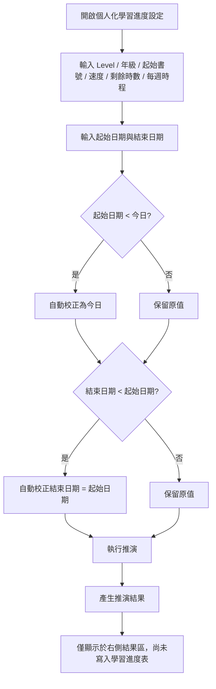
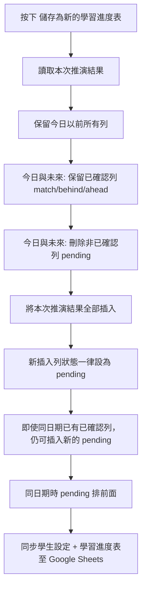
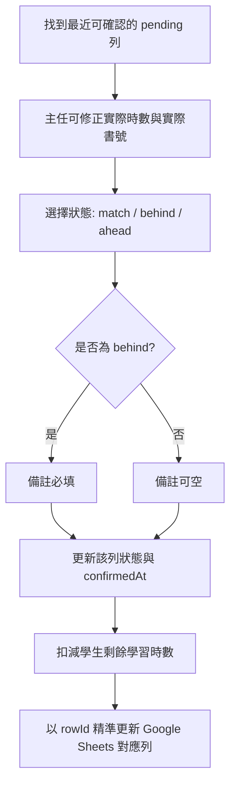
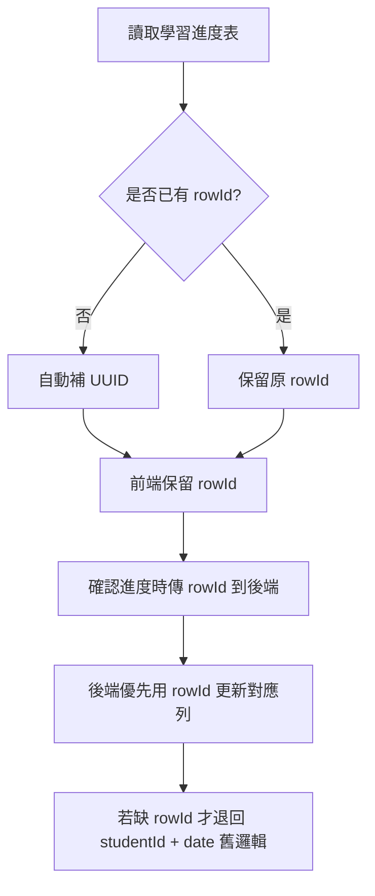

# Goal : MPM 書籍訂購系統

# Background: 
 
##關於MPM
- MPM 數學學習方式: 每個學生自學,依照自己學習進度來學習,不同進度使用不同書籍編號
- MPM 數學書籍編號格式為 {Level}{Grade}{No}。
    Level:定義3種難易度, 由簡單到難依序為GK,GV,GA; 
Grade:1~6 (總共6個年級)
No:不同Level 編號順序不同且中間不連續
    GK: 01~40,41~80
        GV: 01~24,33~56,65~88
GA: 01~24,33~56,65~80

- 向MPM廠商訂購書籍以套為單位: 8本為1套, 例如: GK201~GK208, GV433~GV440, GA265~GA272
- 學生使用書籍的單位為本: 例如: GK201,GV433, GV580,..

##學生進度
- 學習可以自由決定由那一本開始寫, 例如: GK203
- 最多只會寫到該年級該Level的最後一本,例如: GK280, GK680, GV688,GA480, GA680
- 每個學生有Quota 剩餘學習時數
- 每個學生可以決定從星期一~星期日在一週內的分別的時數
- 預設寫的進度: 1小時寫完0.5本
    
   
#Function : 
- 能夠依據剩餘時數及每週進度表,系統自動推演出不同日期下的MPM書號,
- 範例1:  
  初始本:GK203
  時程:星期二:2小時, 星期六:1小時
  速度: 1本/時
  起始日: 2026/4/13(星期一)
  結束日: 無 (預設無表示沒有期限)
  剩餘學習時數:8
  系統自動推演輸出: 
  2026/4/14(星期二,2小時):GK203,GK204
  2026/4/18(星期六,1小時):GK205
  2026/4/21(星期二,2小時):GK206,GK207
  2026/4/25(星期六,1小時):GK208
  2026/4/28(星期二,2小時):GK209,GK210
 摘要: 使用學習時數: 8; 剩餘學習時數:0
  
  
- 範例2: 
  初始本:GV355
  時程:星期三:2小時 星期六:1小時
  速度: 1本/時
  起始日: 2026/4/13(星期一)
  結束日: 無 (預設無表示沒有期限)
  剩餘學習時數:4
  系統自動推演輸出:  
  2026/4/15(星期三,2小時):GV355,GV356 
  2026/4/18(星期六,1小時):GV365
  ---------- 時數已用盡，以下為預估進度 ----------
  2026/4/22(星期三,2小時):GV366,GV367
  2026/4/25(星期六,1小時):GV368
  摘要: 使用學習時數: 6; 剩餘學習時數:-2
  
- 範例3: 
  初始本:GK377
  時程:星期三:2小時 星期六:1小時
  速度: 1本/時
  起始日: 2026/4/13(星期一)
  結束日: 無 (預設無表示沒有期限)
  剩餘學習時數:6
  系統自動推演輸出:
  2026/4/15(星期三,2小時):GK377,GK378 
  2026/4/18(星期六,1小時):GK379
  2026/4/22(星期三,2小時):GK380
  摘要: GK380已到最後一本,使用學習時數: 4; 剩餘學習時數:2
          
- 範例4: 
  初始本:GK377
  時程:星期三:2小時,星期六:1小時
  速度: 1本/時
  起始日: 2026/4/13(星期一)
  結束日: 2026/4/20(星期一)
  剩餘學習時數:6
  系統自動推演輸出:
  2026/4/15(星期三,2小時):GK377,GK378 
  2026/4/18(星期六,1小時):GK379
  摘要: 結束日只到2026/4/20(星期一), 使用學習時數: 3; 剩餘學習時數:3   
 
          
- 範例5: 
  初始本:GK377
  時程:星期三:2小時,星期六:1小時
  速度: 0.5本/時
  起始日: 2026/4/13(星期一)
  結束日: 無 (預設無表示沒有期限)
  剩餘學習時數:10
  系統自動推演輸出:
  2026/4/15(星期三,2小時):GK377
  2026/4/18(星期六,1小時):GK378(1/2)
  2026/4/22(星期三,2小時):GK378(2/2),GK379(1/2)
  2026/4/25(星期六,1小時):GK379(2/2)
  2026/4/29(星期三,2小時):GK380
  摘要: GK380 已到最後一本, 使用學習時數: 8; 剩餘學習時數:2   

# Implementation Rules : 學習進度表實作規則補充

## 1. 個人化學習進度設定
Modal 內的 **個人化學習進度設定** 目前包含:
- Level
- 年級
- 起始書號
- 速度 (本/時)
- 剩餘學習時數
- 訂購預警 K
- 每週時程 (星期一 ~ 星期日)

按下 **套用設定** 後:
- 先更新前端畫面中的學生設定
- 再同步至 Google Sheets 的 `學生設定` 分頁

會同步的欄位:
- `level`
- `grade`
- `confirmedNo`
- `speed`
- `currentRemainingHours`
- `confirmedHours`
- `orderAlertGapKByPerson`
- `mon ~ sun`

不會同步的欄位:
- `起始日期`
- `結束日期`

原因:
- 起始日期 / 結束日期屬於 **推演條件**
- 不是學生主檔設定

---

## 2. 執行推演規則
執行推演時，會讀取:
- 目前已套用或畫面上最新的個人化學習進度設定
- 起始日期
- 結束日期

限制條件:
- 起始日期 **不可早於今日**
- 結束日期 **不可早於起始日期**
- 若輸入不合法，前端會自動校正

推演結果:
- 只顯示推演結果
- 尚未寫入學習進度表
- 必須再按 **儲存為新的學習進度表** 才會正式寫入

---

## 3. 學習進度表狀態定義
目前學習進度表 `status` 使用規則如下:

- `pending`
  - 已推演或已儲存，但尚未確認
- `match`
  - 符合進度
- `behind`
  - 落後進度
- `ahead`
  - 超前進度

補充:
- 舊資料中的 `learned` 會正規化為 `match`

---

## 4. 儲存為新的學習進度表規則
按下 **儲存為新的學習進度表** 時，系統會做以下處理:

### 4.1 保留規則
- **保留今日以前** 的所有列
  - 不論狀態為 `pending / match / behind / ahead`
- **今日當天與今日之後**
  - 若狀態為 **已確認列** (`match / behind / ahead`) -> 保留
  - 否則 -> 刪除

### 4.2 新增規則
- 將本次推演結果全部重新插入
- 新插入的列狀態 **一律為 `pending`**
- 即使同一天已經有一筆舊的已確認列，仍然 **可以再插入新的 `pending` 列**

### 4.3 排序規則
儲存後 UI 顯示順序:
1. 先依日期排序
2. 同日期時，`pending` 排前面
3. 已確認列排後面

這樣可避免:
- 同一天有舊的 `match/ahead/behind`
- 新增一筆 `pending`
- UI 看起來誤以為新列已被確認

---

## 5. 確認進度規則
當學習進度表有 `pending` 列時，可由主任按下 **確認**。

確認時:
- 可調整實際時數
- 可調整實際書號
- 可選擇:
  - 符合進度
  - 落後進度
  - 超前進度
- 若為 **落後進度**
  - 備註必填

確認成功後:
- 該列 `pending` 會更新為 `match / behind / ahead`
- 寫入 `confirmedAt`
- 會同步扣減學生剩餘學習時數
- 會同步更新 Google Sheets

---

## 6. rowId (Primary Key) 規則
因為同一學生、同一天可能有多筆學習進度資料，所以不能只靠:
- `studentId`
- `date`

來判斷要更新哪一列。

因此 `學習進度表` 已加入:
- `rowId`

規則:
- 每一筆學習進度列都有唯一 `rowId`
- 舊資料若沒有 `rowId`，系統會自動補 UUID
- 新增推演列時，前端先產生 `rowId`
- 寫入 Google Sheets 時一併保存
- 確認進度時，優先用 `rowId` 精準更新對應列

好處:
- 同日期多筆資料不會更新錯列
- 可支援未來更多單列編輯功能

---

## 7. Google Sheets 同步規則

### 7.1 套用設定
同步目標:
- `學生設定`

### 7.2 儲存為新的學習進度表
同步目標:
- `學生設定`
- `學習進度表`

流程:
1. 先更新學生設定
2. 再整批寫回學習進度表

### 7.3 確認進度
同步目標:
- `學習進度表`
- `學生設定`

流程:
1. 更新該列學習進度狀態
2. 更新 `confirmedAt`
3. 更新學生 `confirmedNo`
4. 更新學生 `currentRemainingHours / confirmedHours`

### 7.4 首屏學生資料載入規則
同步/讀取目標:
- `學生設定`
- `setting`
- `book_order_state`

規則:
1. 首屏預設分校為 `延壽`
2. 首次進站時，前端只向 Google Sheets 載入 **單一 branch** 的學生資料
3. 不再先抓全部 branch 學生後於前端過濾
4. 前端學生資料採 **lazy load / load once**：
   - 某 branch 學生資料若前端尚未載入，才向 Google Sheets 讀取一次
   - 若前端已存在該 branch 學生資料，切換 branch 時不再重抓
5. `book_order_state` 與 `setting` 仍可全域載入
6. 若目前選取學生不屬於新 branch：
   - 自動改選該 branch 第一位學生
   - 若該 branch 無學生，`selectedStudent = null`

### 7.5 學習進度表部分載入規則
同步/讀取目標:
- `學習進度表`
- `setting`

規則:
1. 學習進度表改為 **依日期窗口部分載入**
2. 預設窗口：
   - 今天前 `30` 天
   - 今天後 `60` 天
3. 上述值改由 global setting 控制：
   - `scheduleLoadPastDays`
   - `scheduleLoadFutureDays`
4. 前端對單一學生讀取進度時，需帶入：
   - `startDate = today - scheduleLoadPastDays`
   - `endDate = today + scheduleLoadFutureDays`
5. 後端 `getSchedule(studentId, startDate, endDate)` 只回傳此區間內資料
6. 同一位學生若已載入相同日期窗口，可直接使用前端快取，不必重抓
7. 若 settings 中窗口值改變，該學生進度需視為未命中快取，重新載入
8. 當使用者在某 branch **第一次選到任一學生** 時，前端會 preload 該 branch 全部學生在同一日期窗口內的 `scheduleTable`
9. preload 完成後，同 branch 內切換學生時，直接使用前端記憶體資料，不再逐位重抓

### 7.6 儲存學習進度表的區間覆寫規則
當前端只載入部分日期區間時，儲存規則需避免覆寫區間外資料。

規則:
1. `saveSchedule` 可帶入：
   - `replaceStartDate`
   - `replaceEndDate`
2. 後端只清除該學生在此區間內、且狀態為 `pending / none` 的舊列
3. 區間外資料不得刪除
4. 已確認列 `match / behind / ahead` 不得因部分載入而被誤刪
5. 新推演結果只回寫目前視窗內需要保留的 `pending` 列

### 7.7 Global Settings 擴充規則
`setting` 分頁除既有欄位外，新增以下 key：

- `scheduleLoadPastDays`
- `scheduleLoadFutureDays`

規則:
1. 兩者皆為大於 `0` 的整數
2. 前端需提供可編輯 UI
3. 後端需提供預設值
4. 若 Sheets 尚無該 key，系統應自動補齊預設值

---

# UI/UX Spec : 載入與互動規格

## 8.1 首屏載入行為
- App 啟動時：
  1. 顯示整體 loading 狀態
  2. 載入 `延壽` branch 學生
  3. 載入 global settings
  4. 載入 `book_order_state`
- 完成後：
  - 左側學生列表只顯示目前 branch 學生
  - 預設選取該 branch 第一位學生
  - 再按需載入該學生的學習進度表

## 8.2 切換 branch 行為
- 使用者切換 branch 時：
  1. 先檢查前端是否已有該 branch 學生資料
  2. 若**尚未載入**：
     - 顯示 loading 狀態
     - 向 Google Sheets 抓取該 branch 學生
  3. 若**已載入**：
     - 直接切換顯示，不重新呼叫學生資料 API
  4. 自動重設選取學生
- branch 學生資料可保留在前端記憶體中，供後續切換重用

## 8.3 學習進度表載入行為
- 學習進度表採 **branch 內批次 preload**
- 當使用者在某 branch 第一次選到任一學生時：
  - 以前端目前設定的日期窗口
  - 一次載入該 branch 全部學生的 schedule
- 若該 branch schedule 正在載入：
  - 詳細區顯示 `scheduleLoading` 狀態
  - 不應誤顯示為「沒有資料」
- 若同 branch 已載入相同日期窗口：
  - 直接使用前端快取
- 若日期窗口改變：
  - 應重新載入目前 branch 各學生 schedule

## 8.4 Settings 調整行為
- Settings Modal 新增兩個欄位：
  - `載入今天前幾天進度`
  - `載入今天後幾天進度`
- 使用者儲存後：
  1. settings 先保存到 Google Sheets
  2. 前端更新目前生效 settings
  3. 目前選取學生的 schedule 視為快取失效
  4. 重新依新日期窗口載入 schedule

## 8.5 待確認 badge 與篩選
### badge 規則
- 學生列表可顯示兩種 badge：
  - `🕒 今待確認`
  - `⏰ 逾期`
- badge 不依賴顏色區分，避免與既有紅 / 橘狀態衝突

### badge 計算方式
- 以學生 `scheduleTable` 中 `status = pending` 的列即時計算
- 只看 `date <= 今天` 的 pending 列
- 取最早一筆待確認日期作為判斷基準：
  - 若最早日期 `< 今天` → 顯示 `⏰ 逾期`
  - 若最早日期 `= 今天` → 顯示 `🕒 今待確認`

### 優先順序
- 若同一學生同時有今日待確認與逾期未確認：
  - 只顯示 `⏰ 逾期`

### filter 規則
- 左側學生列表 filter 保留：
  - `全部`
  - `⚠ 時數預警`
  - `🕒 今待確認`
  - `⏰ 逾期未確認`
- 左側學生列表不再提供 `缺書` filter
- filter 與 badge 共用同一套前端計算規則
- 不新增 Google Sheet 欄位，不新增後端狀態欄位

### 需要套書顯示規則
- 右側學生詳細區保留 `需要套書` 欄位
- 欄位內容顯示為套書區間文字，例如：
  - `GK201~GK208`
  - `GV433~GV440`
- 多套時以 `、` 串接顯示
- 若目前無需準備套書，顯示 `無`
- 若學習進度表尚未載入完成，顯示 `載入進度表中…`

## 8.6 錯誤與空狀態
- 若學生資料載入失敗：
  - 顯示錯誤訊息
  - 不顯示過期列表資料
- 若 branch 無學生：
  - 左側列表顯示空狀態
  - 右側詳情區不顯示學生內容
- 若 schedule 載入失敗：
  - 保留學生主檔顯示
  - 顯示學習進度表載入錯誤訊息

## 8.7 效能目標
- 首屏優先降低 Google Sheets 讀取量
- 先減少：
  - 全 branch 學生一次載入
  - 單一學生全歷史 schedule 一次載入
- 以「單 branch + branch 內首次點選後 preload 全部分校 schedule + 日期窗口」作為基本載入策略

## 8.8 頂部導覽與模組切換
### 桌面版
- TopNav 固定提供：
  - 分校切換：`延壽 / 安和 / 大直`
  - 模組切換：`📚 學習進度`、`📦 書籍訂購`
  - 操作按鈕：`⚙️ 系統設定`、`🔄 重新整理`

### 手機版
- TopNav 僅保留 `☰ 選單`
- 手機版所有主要操作集中於 Drawer
- Drawer 內容包含：
  - branch 下拉選單：`延壽 / 安和 / 大直`
  - 模組切換：`📚 學習進度`、`📦 書籍訂購`
  - 操作按鈕：`⚙️ 系統設定`、`🔄 重新整理`
  - 搜尋 / 篩選
  - 學生清單
- Drawer 規則：
  - 必須支援 `overflow-y: auto`
  - 必須限制 `overflow-x: hidden`
  - scroll bar 必須控制在 Drawer 內，不可由外層頁面承接
- 手機版主畫面應聚焦於目前學生資訊，不再把 branch / module / refresh / settings 散落在內容區上方

### 共通規則
- `📚 學習進度` 為預設模組
- 切換分校時：
  - 左側學生列表只顯示該分校學生
  - 若目前選取學生不屬於該分校，系統自動改選該分校第一位學生
- `🔄 重新整理` 會重新向後端讀取目前需要的資料

## 8.9 手機版學生清單與進度呈現規則
- Drawer 內學生清單需採手機友善的扁平列表設計
- 不再強調獨立大卡片區塊
- 保留：
  - 搜尋
  - 篩選
  - 學生切換
- 點選學生後，Drawer 自動關閉
- 手機版 `學習進度表（全覽）` 改為 Expandable Row / 卡片式展開：
  - 摘要列先顯示：日期、星期、時數、學習狀態
  - 展開後再顯示：預計書號、備註、確認時間
- 桌面版 `學習進度表（全覽）` 仍保留原本表格
- 手機版 `今日進度確認` 改為 stacked arrangement：
  - 日期
  - 實際時數
  - 實際書號
  - 學習狀態
  - 備註
  - 確認按鈕
  以上改為上下堆疊顯示，避免橫向擠壓

## 8.10 學生資料管理規則
- 左側 Sidebar 提供 `＋ 新增學生`
- 右側學生詳細區提供 `編輯學生`
- `新增 / 編輯學生` Modal 欄位包含：
  - 學生編號
  - 學生姓名
  - 分校
  - 國小
  - Level
  - 年級
  - 起始書號
  - 速度（0.5 / 1 本/時）
  - 剩餘學習時數
  - 已購時數
  - 訂購預警 K
  - 每週時程（週一～週日）
- 驗證規則：
  - 學生編號必填
  - 學生姓名必填
  - 分校必選
  - 起始書號需大於 `0`
  - `剩餘學習時數`、`已購時數` 不可為負數
- 編輯模式可刪除學生
- 新增模式不可修改已建立後的學生編號邏輯；編輯時學生編號欄位鎖定

## 8.11 學生詳細區與結果顯示規則
- 右側學生詳細區資訊卡需顯示：
  - 目前使用書號
  - 剩餘學習時數
  - 已購時數
  - 總學習時數
  - 預計耗盡日
  - 時數狀況 badge
  - 學習矩陣-訂購預警窗口 K
  - 需要套書
- `需要套書` 顯示規則：
  - 顯示為套書區間格式，如 `GK201~GK208`
  - 多套以 `、` 串接
  - 無資料時顯示 `無`
  - schedule 尚未載入完成時顯示 `載入進度表中…`
- 詳細區另提供：
  - `編輯學生`
  - `生成學習進度表`
  - `儲值時數`
- `儲值時數`：
  - 僅接受大於 `0` 的整數
  - 可附備註
  - 成功後即時更新剩餘學習時數與時數狀態

## 8.12 書號學習矩陣與訂購互動規則
- 學習矩陣提供：
  - Level 切換：`GK / GV / GA`
  - 範圍切換：`全部 / 本學期`
  - `🔄 同步學習矩陣狀態`
- 視覺狀態：
  - `綠底 X` = 整本已完成
  - `綠底 ◐` = 半本已完成
  - `白底 ○` = 已排入學習進度但尚未確認
  - `黃底 ○` = 有庫存
  - `紅底 ○` = 需訂購 / 無庫存
- 點擊矩陣中已排入進度的格子：
  - 在 `有庫存` 與未標記之間切換
- `訂購此套`：
  - 依 `K` 規則計算近期需要的套書
  - 將該套所有書號標為 `needOrder`
- `同步學習矩陣狀態`：
  - 將目前學生矩陣中的 `inStock / needOrder` 寫回後端 `book_order_state`

## 8.13 書籍訂購模組規則
- `📦 書籍訂購` 模組為查詢頁，不直接修改狀態
- 頁面名稱：`待訂套書總覽`
- 顯示欄位：
  - Level
  - 年級
  - 套書範圍
  - 需訂學生數
  - 學生名單
- 篩選條件：
  - 搜尋：學生姓名或 Level
  - 時間篩選：`全部 / 30天 / 90天 / 半年 / 自選`
  - 自選時可輸入起訖日期
  - `清除篩選` 可重設條件
- 若無資料，顯示 `目前無待訂套書`

## 8.14 系統設定欄位規則
- `⚙️ 系統設定` Modal 對應 Google Sheets `setting`
- 欄位包含：
  - 上學期開始 / 結束
  - 下學期開始 / 結束
  - 每頁筆數
  - 時數不足預警
  - 載入今天前幾天進度
  - 載入今天後幾天進度
  - 學習矩陣-預警無庫存書的提示窗口大小 K
  - 學習進度表-提前提醒需要新套書的天數
- 儲存成功後：
  - 前端立即採用新設定
  - 需要依新日期窗口重新判斷 schedule preload / cache 命中
- 儲存中禁止直接關閉 Modal

## 8.15 使用手冊文件交付規則
- 專案需另提供：
  - `user_manual.md`：完整文字版使用手冊
  - `user_manual_illustrated.md`：圖文版使用手冊
- 圖文版需搭配實際畫面截圖
- 截圖來源以本機執行中的 `http://127.0.0.1:8080/` 為主
- 建議截圖至少涵蓋：
  - 首頁 / 學生列表
  - 學生詳細區
  - 生成學習進度表 Modal
  - 系統設定 Modal
  - 書籍訂購總覽

---

# Flow Rules : 流程圖

## A. 執行推演流程

## B. 儲存為新的學習進度表流程

## C. 確認進度流程

## D. rowId 更新流程

# Summary : 一句話版規則
- **套用設定** = 更新學生主檔設定並同步 Google Sheets
- **執行推演** = 只計算結果，不落地
- **儲存為新的學習進度表** = 保留舊的已確認紀錄，僅覆寫指定日期窗口內未確認列，再插入新的 `pending`
- **確認進度** = 將某筆 `pending` 正式改成 `match / behind / ahead`
- **rowId** = 學習進度表每列的唯一鍵，避免同日期多筆時更新錯列
- **首屏載入** = 只先載入單一 branch（預設 `延壽`）學生，且各 branch 僅首次切換時載入一次
- **學習進度表載入** = 首次點選 branch 任一學生後，preload 該 branch 全部學生在指定日期窗口內的 schedule
- **待確認提示** = 由前端即時計算 `🕒 今待確認 / ⏰ 逾期` badge 與 filter
- **需要套書** = 顯示於右側學生詳細區，使用套書區間格式，不提供左側 `缺書` filter
